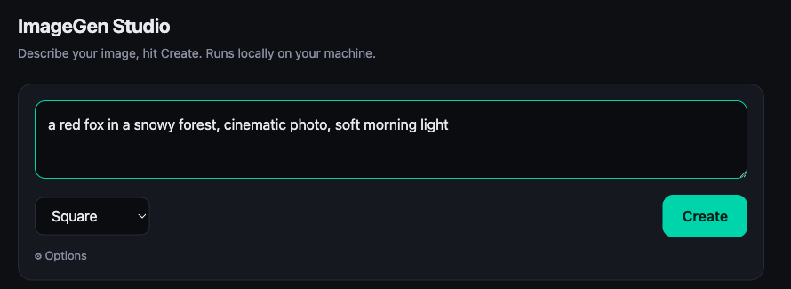

# ImageGen Studio

A dead-simple local front end for [ComfyUI](https://github.com/comfyanonymous/ComfyUI).
A text box and a button — type what you want, get an image. No node graph, no cloud, no account.

Ships in two flavours, same engine:

- **Web UI** — `ui_server.py`: open a page, type, click **Create**, watch a live progress bar.
- **CLI** — `imagegen.py`: `imagegen "a red fox in a snowy forest"` from any terminal.



## Why

ComfyUI is genuinely powerful, but its node editor and API aren't what you want when you
just need a picture — and they're a non-starter for anyone around you who doesn't live in a
terminal. ImageGen Studio is a deliberately thin layer on top: it keeps all the power running
locally underneath and exposes exactly one thing — *describe it, get it*. The goal is to make
local image generation usable by people who shouldn't have to learn a node graph to use it.

## Features

- **Local & private** — talks to ComfyUI on `localhost`. Nothing leaves your machine, no API keys.
- **Strips metadata** — generated PNGs don't carry the embedded prompt/workflow, so sharing an
  image doesn't leak the text you typed (`--keep-meta` to opt out).
- **Live progress** — the web UI shows a real "step X of Y" bar via ComfyUI's WebSocket.
- **Evolve images** — refine an existing image instead of starting over (`--from`, `--strength`).
- **Zero dependencies beyond Pillow** — pure Python standard library otherwise.
- **One-click launcher** — `ImageGen-Studio.command` starts everything and opens the browser.

## Requirements

- Python 3.8+ and [Pillow](https://pypi.org/project/Pillow/) (`pip install pillow`)
- A running **ComfyUI** with at least one **SDXL checkpoint** in `models/checkpoints/`
  (e.g. Juggernaut XL, but any SDXL model works)

## Quick start

```sh
pip install -r requirements.txt

# 1) Make sure ComfyUI is running (default http://localhost:8188)

# 2) Web UI
python3 ui_server.py            # -> http://localhost:7866

# ...or the CLI
python3 imagegen.py "an astronaut riding a horse, cinematic photo"
```

On macOS you can also just **double-click `ImageGen-Studio.command`** — it launches the web UI,
opens your browser, and (if you run ComfyUI through [Pinokio](https://pinokio.computer))
starts ComfyUI for you too.

### Optional: a short `imagegen` command

```sh
# put imagegen.py on your PATH, e.g.
ln -s "$PWD/imagegen.py" ~/.local/bin/imagegen
imagegen "a minimalist logo, mint green"
```

## CLI usage

```sh
imagegen "PROMPT"                       # 1024x1024, saved to the output folder
imagegen "PROMPT" --size 832x1216       # portrait
imagegen "PROMPT" --steps 35 --batch 4  # quality / multiple images
imagegen "PROMPT" --open                # open the result when done
imagegen "PROMPT" --from base.png --strength 0.6   # evolve an existing image
```

`--strength` (with `--from`) controls how much changes: `0.3` subtle retouch · `0.55` noticeable ·
`0.85` strong reinterpretation · `1.0` basically from scratch.

## Configuration

All optional, via environment variables:

| Variable | Default | Meaning |
|---|---|---|
| `COMFY_HOST` | `http://localhost:8188` | Where ComfyUI is reachable |
| `COMFY_CKPT` | *(first available)* | Substring to pick a specific checkpoint, e.g. `juggernaut` |
| `IMAGEGEN_OUT` | `~/imagegen/output` | Where images are saved |
| `IMAGEGEN_UI_PORT` | `7866` | Port for the web UI |

## How it works

Both entry points build a minimal SDXL workflow as a JSON graph and POST it to ComfyUI's
`/prompt` API, poll `/history/<id>` until the image is ready, download it via `/view`, strip the
PNG metadata, and save it. The web UI additionally subscribes to ComfyUI's `/ws` socket to render
the progress bar. That's the whole trick — no custom nodes required.

## License

MIT — see [LICENSE](LICENSE).
